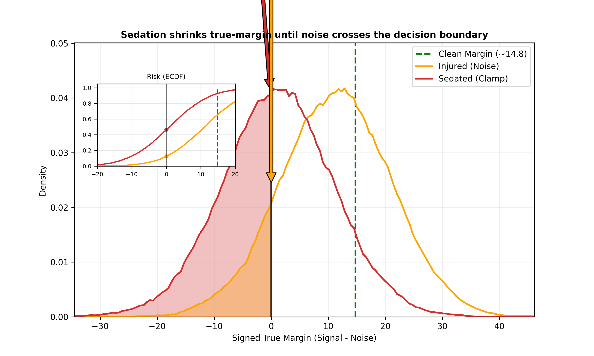
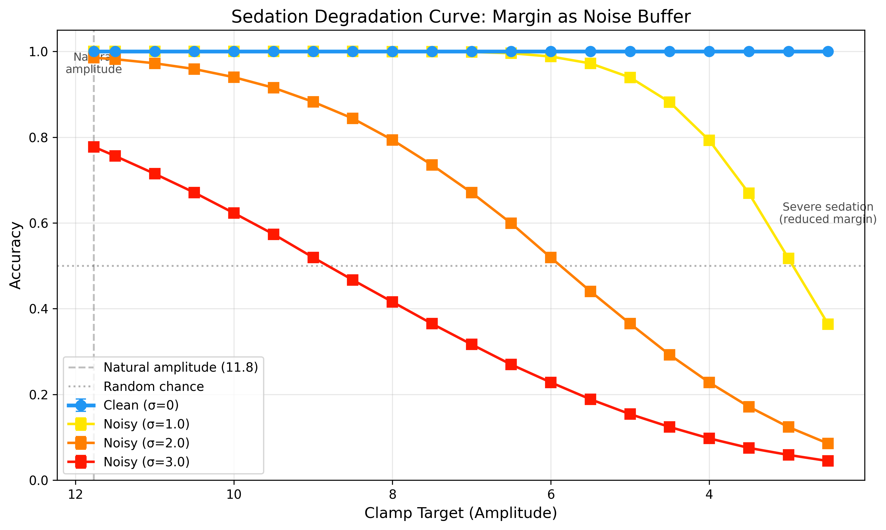
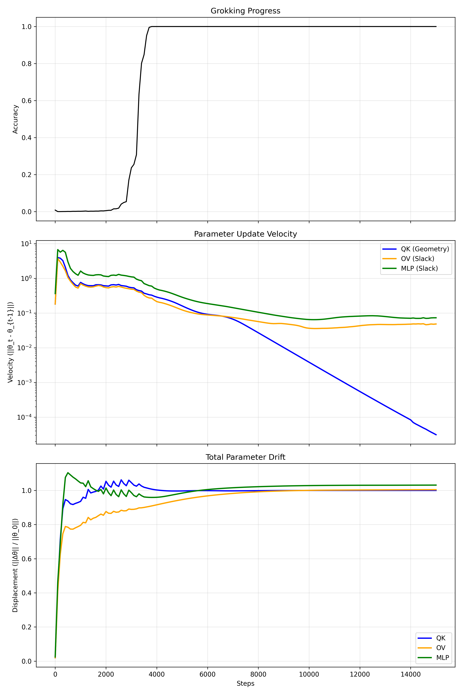
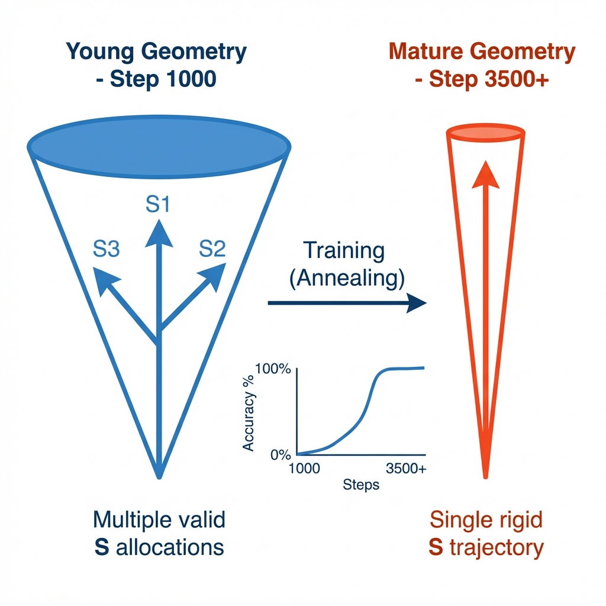
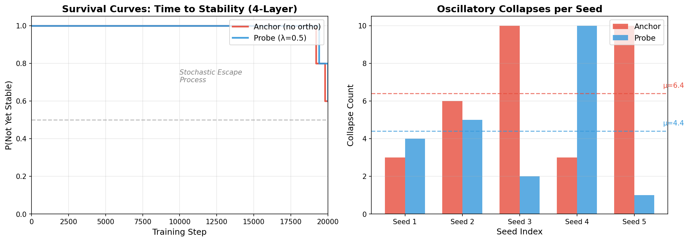

# Locked in Subspace

**The Non-Transferability of Learned Structure in Transformers**

A mechanistic interpretability study demonstrating that Transformer robustness decomposes into two orthogonal, causally distinct factors: **Geometry** (G) and **Slack** (S).

---

## Key Finding

> Transplanting attention routing between two converged models causes near-complete failure (99.99% → 0.02%), providing evidence that learned structure is non-transferable and geometry causally constrains behavior.

---

## The G × S Decomposition

| Factor | Parameters | Role |
|--------|------------|------|
| **Geometry (G)** | QK projections | Determines *what* representations are possible |
| **Slack (S)** | OV circuit, MLP, LayerNorm | Determines *how robustly* the model commits |

The decomposition is **conserved under intervention**: we can freeze, swap, or perturb G and S independently, and the causal structure remains identifiable.

---

## Results

### 1. No Dynamic Compensation

Models exhibit no inference-time "gain reflex." When acute damage reduces accuracy, the operating amplitude remains unchanged. Robustness comes from **stored margin**, not dynamic compensation.

| Condition | Noise (σ) | Accuracy | Mean Margin |
|-----------|-----------|----------|-------------|
| Healthy Baseline | 0.0 | 99.9% | 8.55 |
| Mild Perturbation | 0.3 | 99.9% | 8.47 |
| Severe Perturbation | 2.0 | 99.2% | 5.74 |
| Critical Perturbation | 3.0 | 82.9% | 3.02 |


*Figure 1: The Stored Margin. Clean models maintain high safety margins; noise increases variance; clamping compresses margin into the failure zone.*

---

### 2. Margin as Pre-Allocated Robustness Buffer

Incrementally clamping amplitude reveals that excess margin serves as a quantifiable noise buffer. Clean accuracy is insensitive to amplitude; noisy accuracy tracks amplitude linearly.


*Figure 2: Amplitude clamping sweep. Under clean conditions, accuracy remains high even at 20% amplitude. Under noise, accuracy degrades monotonically with attenuation.*

---

### 3. Routing Swap Causes Catastrophic Failure

Transplanting QK parameters from one model to another causes complete performance collapse, even though both parents achieved 99.99% accuracy.

| Swap Condition | Accuracy | Δ from Baseline |
|----------------|----------|-----------------|
| Model A (Baseline) | 99.99% | --- |
| Swap 1 Head | 47.1% | −52.9% |
| Swap 2 Heads | 11.7% | −88.3% |
| **Swap All Heads** | **0.02%** | **−99.97%** |

This proves that slack learned under one geometry is incompatible with another.

---

### 4. Geometry Stabilizes Before Slack

Parameter velocity tracking reveals a distinct temporal ordering: the QK circuit stabilizes early (~step 4000), while OV/MLP continues to evolve long after.


*Figure 3: Geometry (blue) stabilizes before Slack (red). The model establishes routing structure first, then optimizes within it.*

---

### 5. Early-Phase Geometry Defines a Solution Subspace

During the critical period, frozen geometry permits multiple orthogonal slack allocations to achieve 100% accuracy. As training progresses, the model specializes onto a single trajectory.


*Figure 4: Progressive Specialization. Early routing permits multiple solutions; mature models are fixed.*

| Depth | Model | Accuracy | Residual CosSim |
|-------|-------|----------|-----------------|
| 1-Layer | Anchor | 100% | 1.00 |
| 1-Layer | Probe | 100% | **0.00** |
| 2-Layer | Anchor | 100% | 1.00 |
| 2-Layer | Probe | 100% | **0.00** |

---

### 6. Metastable Dynamics at Depth

At 4 layers, training dynamics become stochastic. Models exhibit repeated collapse/recovery cycles, and stability emerges probabilistically rather than deterministically.


*Figure 5: Stochastic Escape. Kaplan-Meier style survival curves showing time-to-stability at 4 layers.*

| Metric | 4-Layer | Interpretation |
|--------|---------|----------------|
| Stability Rate | 40-50% | Stochastic, not deterministic |
| Mean Collapses | 6.4 ± 3.1 | High variance |
| Final Accuracy Std | 44% | Signature of escape process |

---

## Repository Structure

```
allo-audit/
├── experiments/
│   ├── phase_1_foundation/     # Core 1-layer experiments
│   ├── phase_2_depth/          # 2-layer validation
│   ├── phase_3_alternatives/   # Alternative interpretations
│   ├── phase_4_metastability/  # 4-layer dynamics
│   ├── phase_5_language/       # TinyStories (8L)
│   └── phase_6_othello/        # Othello-GPT
│
├── lib/                        # Core utilities
│   ├── metrics.py              # AllostasisAudit (G, S, Psi measurement)
│   ├── clamps.py               # Variance clamp interventions
│   ├── part_b_utils.py         # QK surgery, parameter freezing
│   └── deep_transformer.py     # Multi-layer models
│
├── data/                       # Experiment results
├── paper/                      # LaTeX source and figures
├── FINDINGS.md                 # Detailed research log
└── README.md
```

---

## Quick Start

```bash
# Clone
git clone https://github.com/Mat-Tom-Son/LostInSubSpace.git
cd LostInSubSpace

# Install
pip install -r requirements.txt

# Run key experiment (routing swap)
python experiments/phase_1_foundation/exp_1_interleaved.py --quick_test

# Run 4-layer metastability analysis
python experiments/phase_4_metastability/run_all.py --quick_test
```

---

## Citation

```bibtex
@article{lostinsubspace2026,
  title={Locked in Subspace: The Non-Transferability of Learned Structure in Transformers},
  author={Thompson, Mat},
  year={2026},
  url={https://github.com/Mat-Tom-Son/LostInSubSpace}
}
```

---

## License

MIT
